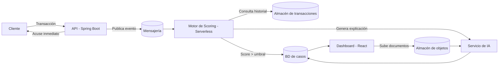

# Centinela 🛡️

**Sistema de detección de fraude transaccional en tiempo real para el sector Fintech.**


Proyecto integrador · 3 semanas · Trabajo por células

---

## 📑 Tabla de contenidos

1. [¿Por qué existe Centinela?](#1-por-qué-existe-centinela)
2. [¿Qué es Centinela?](#2-qué-es-centinela)
3. [Propósito del proyecto](#3-propósito-del-proyecto)
4. [Motor de detección: cómo funciona](#4-motor-de-detección-cómo-funciona)
5. [Arquitectura del sistema](#5-arquitectura-del-sistema)
6. [Recorrido de una transacción](#6-recorrido-de-una-transacción)
7. [Actores del sistema](#7-actores-del-sistema)
8. [Dónde vive cada dato](#8-dónde-vive-cada-dato)
9. [Estructura del repositorio](#9-estructura-del-repositorio)
10. [Stack tecnológico](#10-stack-tecnológico)
11. [Requisitos previos](#11-requisitos-previos)
12. [Guía de ejecución](#12-guía-de-ejecución)
13. [Variables de entorno y secretos](#13-variables-de-entorno-y-secretos)
14. [Matriz de roles y accesos](#14-matriz-de-roles-y-accesos)
15. [Documentación adicional](#15-documentación-adicional)
16. [Reglas del juego / principios de diseño](#16-reglas-del-juego--principios-de-diseño)
17. [Roadmap](#17-roadmap)
18. [Licencia](#18-licencia)

---

## 1. ¿Por qué existe Centinela?

El sector financiero enfrenta el desafío constante de proteger las transacciones de sus usuarios sin sacrificar la experiencia de usuario. La mayoría de los sistemas actuales sufren de latencias elevadas o falsos positivos que frustran a los clientes. **Centinela** nace como una solución robusta para identificar comportamientos sospechosos mediante reglas heurísticas y un pipeline asíncrono, garantizando seguridad sin afectar la velocidad de respuesta del cliente.

## 2. ¿Qué es Centinela?

Centinela es un sistema que vigila el flujo de transacciones financieras de una fintech y detecta, en tiempo real, cuáles son potencialmente fraudulentas.

Cada vez que un cliente hace una compra, transferencia o retiro, la transacción entra a Centinela. El sistema la analiza contra un conjunto de reglas de riesgo, calcula un puntaje (*score*) y decide en cuestión de milisegundos:

- **Score bajo** → la transacción sigue su curso normal. El cliente ni se entera.
- **Score alto** → la transacción se marca, se abre un caso de fraude y un analista humano lo revisa con toda la evidencia en la mano.

El producto final es la plataforma completa: la API que recibe transacciones, el motor que las puntúa, el sistema de gestión de casos para los analistas, y toda la infraestructura en la nube que lo sostiene.

## 3. Propósito del proyecto

El objetivo principal de Centinela es automatizar la detección de fraude siguiendo tres pilares críticos:

* **Seguridad:** implementación de un modelo *Zero-Trust* utilizando identidades gestionadas y almacenamiento privado para evitar la exposición a internet.
* **Escalabilidad:** arquitectura basada en mensajería capaz de absorber picos de tráfico financieros.
* **Auditabilidad:** cada decisión tomada por el sistema es explicable y trazable, permitiendo a los equipos de auditoría y analistas de fraude tener una visión completa del ciclo de vida de cada caso.

Detectar fraude con reglas no es lo difícil; lo difícil es sostener ese análisis bajo restricciones reales:

- **El cliente no puede esperar.** La respuesta debe ser inmediata; la transacción nunca se queda colgada esperando cálculos pesados.
- **El volumen no es constante.** El sistema debe absorber picos de tráfico (ej. viernes en la noche) sin perder datos ni degradarse.
- **El sistema no se puede caer.** Si Centinela deja de responder, la fintech deja de operar.

## 4. Motor de detección: cómo funciona

La detección se basa en **reglas heurísticas**, no en Machine Learning: cada regla es lógica explícita, explicable y auditable. Cada regla que se dispara suma puntos al score total de la transacción.

### Reglas base

| # | Regla | Descripción |
|---|---|---|
| 1 | **Velocidad de transacción** | Demasiadas transacciones desde la misma cuenta en una ventana corta de tiempo (ej. 8 compras en 3 minutos). |
| 2 | **Monto atípico** | El monto está muy por encima del comportamiento histórico de la cuenta. |
| 3 | **Ubicación geográficamente imposible** | Dos transacciones de la misma cuenta desde ubicaciones que no se pueden recorrer en el tiempo transcurrido entre ellas. |
| 4 | **Comercio o categoría de riesgo** | La transacción va hacia un comercio o categoría previamente marcada como sospechosa. |

### Scoring y umbral

Cada regla disparada suma puntos. La suma total es el score de la transacción. Si el score supera un **umbral configurable** (no un valor quemado en código), la transacción se marca y se abre un caso. El valor del umbral es una decisión de diseño que debe justificarse: muy bajo genera falsos positivos y satura a los analistas; muy alto deja pasar fraude real.

> **Umbral actual:** `[completar, ej. 70 puntos]` — justificación: `[completar]`

### Rol de la IA

En este proyecto **la IA no detecta el fraude** — eso lo hacen las reglas heurísticas. La IA cumple dos funciones puntuales:

- **Explicabilidad:** cuando una transacción se marca, un servicio de IA redacta en lenguaje natural la razón de la marca, para que el analista entienda el caso sin leer código ni logs.
- **Verificación de identidad:** cuando un analista escala un caso, sube un documento del titular (cédula, extracto bancario) y un servicio de IA extrae automáticamente sus datos para verificarlos.

## 5. Arquitectura del sistema

El proyecto está construido bajo un enfoque modular para facilitar el mantenimiento y la escalabilidad:

* **Backend:** API de alta disponibilidad desarrollada en **Java 21 con Spring Boot**, encargada de la ingesta y validación de transacciones.
* **Motor de scoring:** componente serverless (`[completar, ej. Azure Functions]`) que reacciona a eventos, consulta historial y aplica las reglas.
* **Frontend:** dashboard interactivo en **React**, diseñado para que los analistas de fraude gestionen casos y verifiquen documentos.
* **Mensajería:** `[completar, ej. Azure Service Bus / Event Hubs]`, encargada de desacoplar la ingesta del análisis y absorber picos de tráfico.
* **Infraestructura:** desplegada en **Azure** mediante *Infraestructura como Código (IaC)*, asegurando que el entorno sea reproducible y auditable.



## 6. Recorrido de una transacción

Este es el camino que hace una transacción desde que entra hasta que un analista la ve:

1. **Ingesta.** La API recibe la transacción y responde de inmediato con un acuse. No espera al análisis.
2. **Publicación del evento.** La transacción se publica como un evento en el sistema de mensajería. Aquí termina la responsabilidad de la API.
3. **Scoring.** Un componente serverless reacciona al evento, consulta el historial reciente de esa cuenta, aplica las reglas y calcula el score.
4. **Decisión.** Si el score supera el umbral, se encola un caso de fraude. Si no, la transacción simplemente queda registrada.
5. **Apertura del caso.** El caso se crea en la base de datos de gestión, listo para ser asignado a un analista.
6. **Explicación.** Se genera la explicación en lenguaje natural del porqué de la marca.
7. **Resolución.** El analista revisa, decide y cierra el caso. Todo queda auditado.

> **Punto crítico:** entre el paso 1 y el paso 7 pueden pasar segundos, pero el cliente ya recibió su respuesta en el paso 1. Si la arquitectura hace que el cliente espere por el paso 6, está mal diseñada.

## 7. Actores del sistema

| Rol | Qué hace |
|---|---|
| **Cliente** | No interactúa con Centinela directamente. Solo origina transacciones que entran al sistema. |
| **Analista de fraude** | Revisa los casos marcados, ve la evidencia y la explicación generada, y resuelve: confirma el fraude o lo descarta como falso positivo. Puede escalar un caso subiendo documentos de verificación. |
| **Administrador** | Configura las reglas, ajusta el umbral de scoring, gestiona comercios de riesgo y administra usuarios. |
| **Auditor** | Puede consultar la información y la trazabilidad del sistema, pero no puede modificar configuraciones, reglas, casos, usuarios ni recursos. |
| **Servicio** | Identidad que usan los componentes internos del sistema para hablar entre sí. Tiene únicamente los permisos que necesita para operar el pipeline, nada más. |

## 8. Dónde vive cada dato

El sistema maneja tres tipos de información con necesidades distintas:

| Tipo de dato | Necesidad | Almacén elegido | Justificación |
|---|---|---|---|
| **Transacciones y scores** | Alto volumen, baja latencia, consulta dominante: "transacciones recientes de esta cuenta" | `[completar, ej. Azure Cosmos DB / Table Storage]` | `[completar: cómo se particiona la clave y por qué]` |
| **Casos de fraude** | Relacional, transaccional (caso ↔ analista ↔ resolución ↔ auditoría), integridad ACID | `[completar, ej. Azure SQL Database]` | `[completar]` |
| **Documentos de verificación** | Archivos binarios (PDFs, imágenes) subidos por analistas | `[completar, ej. Azure Blob Storage]` | `[completar]` |

## 9. Estructura del repositorio

```text
centinela/                      <-- Carpeta raíz del repositorio
├── backend/                    <-- Lógica de negocio y motor de scoring (Java)
│   ├── .mvn/                   <-- Wrapper de Maven
│   ├── src/                    <-- Código fuente Java
│   ├── pom.xml                 <-- Dependencias del proyecto
│   ├── mvnw                    <-- Script de ejecución Maven
│   └── ...
├── frontend/                   <-- Interfaz de usuario (React)
│   ├── src/                    <-- Componentes y lógica UI
│   ├── package.json            <-- Dependencias de Node.js
│   └── ...
├── infra/                      <-- Scripts de automatización e IaC
│   └── deploy.sh                <-- Script principal de despliegue Azure
└── docs/                        <-- Documentación de cada semana y contratos de eventos
```

## 10. Stack tecnológico

| Capa | Tecnología |
|---|---|
| Backend | Java 21, Spring Boot |
| Frontend | React |
| Mensajería | `[completar]` |
| Cómputo serverless | `[completar]` |
| Base de datos transaccional | `[completar]` |
| Base de datos de casos | `[completar]` |
| Almacenamiento de objetos | `[completar]` |
| IA / Explicabilidad | `[completar]` |
| Infraestructura | Azure + IaC (`[completar: Bicep / Terraform / ARM]`) |
| Gestión de secretos | `[completar, ej. Azure Key Vault]` |

## 11. Requisitos previos

- [Azure CLI](https://learn.microsoft.com/cli/azure/install-azure-cli) instalado.
- Cuenta de Azure activa con permisos de suscripción.
- Java 21 y Maven (para correr el backend localmente).
- Node.js `[versión]` y npm/yarn (para correr el frontend localmente).
- `[completar cualquier otra herramienta: Docker, Azure Functions Core Tools, etc.]`

## 12. Guía de ejecución

Este proyecto utiliza automatización para eliminar el error humano.

### Despliegue de infraestructura (Semana 1 + Semana 2, un solo comando)

`scripts/deploy-all.sh` levanta toda la infraestructura entregada hasta hoy, en orden
de dependencias e idempotente.

**Guía completa de despliegue: [DESPLIEGUE.md](DESPLIEGUE.md)** — requisitos por sistema
operativo, instalación de dependencias, parámetros, verificación y destrucción, con todos
los comandos copiables. El runbook por issue está en
[docs/4_Infraestructura_y_Despliegue/5_Runbook_Despliegue_Completo.md](docs/4_Infraestructura_y_Despliegue/5_Runbook_Despliegue_Completo.md).

```bash
# 1. Clonar y situarse en la entrega estable
git clone https://github.com/Centinela-App/Centinela.git && cd Centinela
git checkout develop

# 2. Iniciar sesión y fijar la suscripción
az login
az account set --subscription "<subscription-id>"

# 3. Parámetros locales (nunca se commitea .env)
cp .env.example .env && nano .env     # SUBSCRIPTION_ID, LOCATION, RESOURCE_GROUP, NAME_PREFIX, APP_SERVICE_SKU

# 4. Ensayo en seco: valida herramientas, sesión, región y SKU sin crear nada
bash scripts/deploy-all.sh --validate-only

# 5. Despliegue completo (40-60 min)
bash scripts/deploy-all.sh --yes --with-tests

# 6. Al terminar la demostración: destruir para no consumir crédito
bash scripts/destroy-week1.sh --yes --wait
```

Para seguir el avance en vivo, en **otra** terminal:

```bash
bash scripts/watch-deploy.sh
# [###################.......................]  47%   8/17  S2 PostgreSQL privado  (3s)
```

> **Requisitos:** Azure CLI, JDK 21 (`JAVA_HOME`), Maven, `git`, `psql` y `jq`. En Windows
> los instaladores no añaden `psql` ni `jq` al `PATH`; los scripts los localizan solos en
> las rutas estándar, así que no hace falta configurar nada a mano.

> **Sobre el acceso privado.** Cosmos, PostgreSQL, Key Vault y Storage tienen el acceso
> público deshabilitado por diseño. Desde un runner unido a la VNet (Cloud Shell
> inyectado, jumpbox o VPN) el despliegue usa la ruta privada. Desde una máquina externa,
> el bootstrap de PostgreSQL abre una **ventana temporal acotada a la IP del operador** y
> la cierra al terminar; el estado final es siempre `publicNetworkAccess=Disabled`.
> Detalles y límites en [DESPLIEGUE.md](DESPLIEGUE.md#7-nota-sobre-la-conexión-a-postgresql).

> **¿Aprendiendo Azure?** [GUIA_TECNICA_SCRIPTS.md](GUIA_TECNICA_SCRIPTS.md) explica qué
> hace cada script, cómo funciona por dentro y **cómo harías lo mismo a mano** con `az` o
> en el Portal, además de los conceptos base (control plane vs data plane, Managed
> Identity, RBAC por ámbito, Private Endpoints y DNS privado).

> **Errores corregidos.** El endurecimiento de estos scripts está documentado en
> [docs/4_Infraestructura_y_Despliegue/6_Informe_Errores_Corregidos.md](docs/4_Infraestructura_y_Despliegue/6_Informe_Errores_Corregidos.md):
> 30 defectos por causa raíz, incluidos cuatro que producían despliegues aparentemente
> exitosos pero funcionalmente rotos.

### Ejecución local (desarrollo)

```bash
# Backend (Spring Boot; requiere Java 21 y Maven)
mvn spring-boot:run

# Motor de scoring (Azure Function)
cd scoring-function && mvn clean verify
```

## 13. Variables de entorno y secretos

Ningún secreto vive en el código. Cadenas de conexión, claves de API y credenciales se gestionan a través de `[completar, ej. Azure Key Vault]`. Un secreto en un commit se considera un secreto comprometido, aunque después se borre.

Variables esperadas (ejemplo, ajustar a la implementación real):

```env
AZURE_SUBSCRIPTION_ID=
SERVICE_BUS_CONNECTION_STRING=   # o el nombre real del recurso de mensajería
DATABASE_CONNECTION_STRING=
BLOB_STORAGE_CONNECTION_STRING=
AI_SERVICE_ENDPOINT=
AI_SERVICE_KEY=
```

### 13.1 Scripts de infraestructura (Semana 1 · ISS-S1-002)

Los scripts de `scripts/` despliegan, validan y destruyen la infraestructura de Semana 1.
Toman su configuración de un archivo `.env` local (nunca versionado; ver `.env.example`).

**Parámetros obligatorios (en `.env`):**

| Parámetro | Descripción | Ejemplo |
|---|---|---|
| `SUBSCRIPTION_ID` | ID de la suscripción de Azure (UUID) | `az account show --query id -o tsv` |
| `LOCATION` | Región de Azure | `eastus2` |
| `RESOURCE_GROUP` | Nombre del Resource Group | `rg-centinela-week1` |
| `NAME_PREFIX` | Prefijo de recursos (3–11 minúsculas/números) | `cent` |
| `APP_SERVICE_SKU` | SKU con soporte de slots y escala | `S1` |

**Preparación:**

```bash
cp .env.example .env      # y rellena tus valores reales (NO se commitea)
az login                  # sesión de Azure activa
```

**Comandos:**

```bash
# Validar entorno (parámetros + sesión az + región + SKU) sin crear nada:
bash scripts/validate-week1.sh

# Ver el plan de despliegue sin crear recursos:
bash scripts/deploy-week1.sh --validate-only

# Desplegar (crea el Resource Group con tags y ejecuta los pasos disponibles):
bash scripts/deploy-week1.sh

# Destruir (pide teclear el nombre exacto del RG para confirmar):
bash scripts/destroy-week1.sh
bash scripts/destroy-week1.sh --yes   # modo automatización, sin prompt

# Pruebas obligatorias de la issue:
bash scripts/tests/test-deploy-parameters.sh   # TEST-S1-003
bash scripts/tests/test-destroy-safety.sh      # TEST-S1-004
```

> ⚠️ **Costos:** los recursos consumen el crédito compartido de USD 200. Ejecuta
> `destroy-week1.sh` al terminar para no dejar recursos encendidos.

## 14. Matriz de roles y accesos

Para cumplir con el principio de menor privilegio, el sistema gestiona cuatro roles definidos:

| Rol | Permisos | Responsabilidad |
|---|---|---|
| **Administrador** | Contributor | Configuración, reglas y despliegue del sistema. |
| **Analista** | Reader | Gestión de casos de fraude y verificación de identidad. |
| **Auditor** | Reader | Acceso de solo lectura para auditorías y trazabilidad. |
| **Servicio** | Managed Identity | Identidad para comunicación segura entre componentes. |

## 15. Documentación adicional

El proyecto se desarrolla en tres semanas, cada una con su propio documento de alcance:

- **Semana 1 — Fundamentos:** infraestructura, identidad, red, almacenamiento y puerta de entrada. La API recibe, valida y almacena transacciones; queda operativa la carga de documentos y la cola del pipeline.
- **Semana 2 — El motor:** pipeline serverless de scoring y almacenes de datos. Una transacción que entra se puntúa automáticamente y abre un caso si corresponde. `[Ver /docs/semana-2.md]`
- **Semana 3 — Producción:** automatización del despliegue, integración de los servicios de IA y observabilidad. `[Ver /docs/semana-3.md]`

- 📄 [Contrato de eventos](./docs/contrato-eventos.md) `[completar / crear]`
- 📄 [Decisiones de arquitectura (ADR)](./docs/adr/) `[completar / crear]`

## 16. Reglas del juego / principios de diseño

- **El lenguaje es libre**, siempre que el contrato de eventos y payloads que cruzan el pipeline esté definido y documentado desde el inicio.
- **La infraestructura se crea por script, no a mano.** Debe poder recrearse desde cero ejecutando un script versionado en el repositorio.
- **Ningún secreto vive en el código.** Todo va en un gestor de secretos.
- **Todo se justifica.** No se evalúa que se haya usado un servicio, sino por qué se usó y qué costó (rendimiento, complejidad, dinero).

## 17. Roadmap

- [ ] Semana 1 — Fundamentos e ingesta
- [ ] Semana 2 — Motor de scoring y persistencia
- [ ] Semana 3 — IA, observabilidad y despliegue automatizado end-to-end

## 18. Licencia

`[completar, ej. MIT License — ver LICENSE]`

---

# Centinela
# Centinela
# Centinela

---

# Semana 3 — Despliegue en contenedores, CI/CD y observabilidad

Esta sección completa el despliegue hasta el cierre del proyecto. Asume que las Fases 1 y 2
(Semanas 1 y 2) ya se ejecutaron con `scripts/deploy-all.sh`.

## Qué se despliega ahora

| Recurso | Nombre | Para qué |
|---|---|---|
| Azure Container Registry | `<prefijo>acr` | Registro privado de imágenes |
| Managed Identity | `id-<prefijo>-acrpull` | *Pull* sin credenciales |
| Container Apps Environment | `cae-<prefijo>` | Plataforma de ejecución |
| Log Analytics | `log-<prefijo>` | Almacén de telemetría |
| Application Insights | `appi-<prefijo>` | Trazas y consultas de operación |
| Container App — API | `ca-<prefijo>-api` | Ingesta y consulta |
| Container App — scoring | `ca-<prefijo>-scoring` | Motor de reglas |
| Container App — explicador | `ca-<prefijo>-explainer` | Explicaciones y extracción documental |

## Despliegue desde cero

### 1. Aprovisionar

```bash
bash scripts/provision-container-registry.sh     # ACR + identidad de pull
bash scripts/provision-container-apps.sh         # Log Analytics + entorno
CENTINELA_ALERT_EMAIL="operaciones@ejemplo.com" \
  bash scripts/provision-observability.sh        # App Insights + alerta
```

Cada script admite `--validate-only`: imprime el plan sin crear nada. Úsalo la primera vez.

### 2. Configurar el pipeline

```bash
CENTINELA_GITHUB_REPO="Centinela-App/Centinela" \
  bash scripts/provision-github-oidc.sh
```

El script imprime al final los tres *secrets* y las cuatro *variables* que hay que registrar en
GitHub. **No hay ninguna contraseña entre ellos**: son identificadores, y no sirven sin un token
firmado por GitHub para este repositorio y esta rama.

### 3. Desplegar

A partir de aquí, cada integración a `main` despliega sola. Para la primera vez, o para
desplegar a mano:

```bash
export IMAGE_TAG="$(git rev-parse HEAD)"
docker build -t "<prefijo>acr.azurecr.io/centinela-api:$IMAGE_TAG" .
docker build -t "<prefijo>acr.azurecr.io/centinela-scoring:$IMAGE_TAG" ./scoring-function
az acr login --name "<prefijo>acr"
docker push "<prefijo>acr.azurecr.io/centinela-api:$IMAGE_TAG"
docker push "<prefijo>acr.azurecr.io/centinela-scoring:$IMAGE_TAG"

bash scripts/deploy-containers.sh --tag "$IMAGE_TAG"
bash scripts/verify/verify-deployment-health.sh
```

### 4. Configurar los secretos de la aplicación

Las tres Container Apps necesitan las cadenas de conexión de Cosmos y de PostgreSQL. Se
referencian desde Key Vault mediante la identidad de cada aplicación; **no se escriben en
ningún archivo del repositorio ni en la imagen**:

```bash
az containerapp secret set -g "$RESOURCE_GROUP" -n "ca-${NAME_PREFIX}-api" \
  --secrets "cosmos-mongo=keyvaultref:<uri-del-secreto>,identityref:<id-de-la-identidad>"

az containerapp update -g "$RESOURCE_GROUP" -n "ca-${NAME_PREFIX}-api" \
  --set-env-vars "CENTINELA_COSMOS_MONGO_CONNECTION_STRING=secretref:cosmos-mongo"
```

## Verificar que funciona

```bash
# Sin necesidad de Azure: estructura, pruebas, migraciones, ausencia de credenciales
bash scripts/verify/verify-practices.sh

# Con el sistema desplegado
bash scripts/verify/verify-deployment-health.sh
bash scripts/verify/verify-trace.sh <transactionId>
bash scripts/verify/verify-explainer-correspondence.sh <transactionId>
bash scripts/verify/verify-image-secrets.sh "<prefijo>acr.azurecr.io/centinela-api:latest"
```

También hay siete agentes de auditoría en `.claude/agents/` que ejecutan estos scripts y emiten
un veredicto razonado: `verify-infra`, `verify-secrets`, `verify-containers`, `verify-cicd`,
`verify-observability`, `verify-explainer` y `verify-practices`.

## Demostrar el escalado

```bash
# Terminal 1 — observar
bash scripts/verify/verify-scaling.sh

# Terminal 2 — generar carga desde el banco de pruebas
# (botón "Generar carga" en centinela-lab, 20 tx/s durante 120 s)
```

Una configuración de escalado documentada **no es evidencia** de que el escalado ocurra. El
script guarda la observación real en `docs/evidence/iss-s3-009/`.

## Los dos escenarios de fallo

**Documento ilegible.** Botón homónimo en `centinela-lab`. Abre un caso legítimo y le adjunta un
PDF corrupto. El caso debe seguir consultable y el resultado del intento queda registrado.

**Explicador detenido.**

```bash
# Detener
az containerapp update -g "$RESOURCE_GROUP" -n "ca-${NAME_PREFIX}-explainer" \
  --min-replicas 0 --max-replicas 0

# Lanzar un escenario fraudulento: el caso se abre y queda en PENDING

# Restablecer: las explicaciones pendientes se generan solas
az containerapp update -g "$RESOURCE_GROUP" -n "ca-${NAME_PREFIX}-explainer" \
  --min-replicas 0 --max-replicas 3
```

## Control de crédito

El consumo alcanza su máximo esta semana: la generación de carga, la construcción repetida de
imágenes y la ingesta de telemetría coinciden.

```bash
bash scripts/shutdown-daily.sh          # al cerrar la jornada
bash scripts/shutdown-daily.sh --start  # al retomar
```

Apaga lo que factura por tiempo —Container Apps, App Service, PostgreSQL— y deja intacto lo que
factura por almacenamiento, porque apagarlo equivaldría a destruirlo.

**Costos recurrentes que quedan:** ACR Basic (~0,167 USD/día; no existe un nivel gratuito de ACR)
y el almacenamiento de Cosmos y Blob, ambos dentro de sus niveles gratuitos.

## Banco de pruebas

Vive en un repositorio aparte: [`centinela-lab`](../centinela-lab). Un botón por causal de
alerta, un control negativo, el escenario de documento ilegible y el generador de carga. Es un
cliente externo — no comparte código, base de datos ni despliegue con Centinela.

## Problemas frecuentes

| Síntoma | Causa | Solución |
|---|---|---|
| `verify-deployment-health.sh` agota su tiempo | La aplicación tarda ~220 s en arrancar (Spring Boot + Flyway + primera conexión por Private Endpoint) | Subir `CENTINELA_HEALTH_ATTEMPTS`; revisar `az containerapp logs show` |
| `az containerapp` no se reconoce | Falta la extensión | `az extension add --name containerapp --upgrade` |
| El caso se abre pero queda `PENDING` | El explicador está a cero réplicas o no puede llegar a Cosmos | Verificar `CENTINELA_COSMOS_MONGO_CONNECTION_STRING` en la Container App del explicador |
| `verify-trace.sh` no encuentra la transacción | Application Insights tarda 1–3 minutos en indexar | Esperar y reintentar |
| El escenario de comercio de riesgo no alerta | La lista de riesgo del motor no incluye esa categoría | Revisar `RISKY_CATEGORIES` en la configuración del motor |
